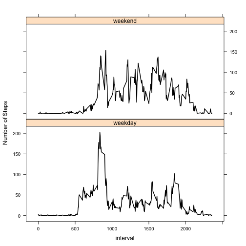

# Reproducible Research: Peer Assessment 1

## Introduction

It is now possible to collect a large amount of data about personal movement
using activity monitoring devices such as a [Fitbit](http://www.fitbit.com/), 
[Nike Fuelband](http://www.nike.com/us/en_us/c/nikeplus-fuelband), or 
[Jawbone Up](https://jawbone.com/up). These type of devices are part of the 
“quantified self” movement – a group
of enthusiasts who take measurements about themselves regularly to improve
their health, to find patterns in their behavior, or because they are tech 
geeks. But these data remain under-utilized both because the raw data are hard 
to obtain and there is a lack of statistical methods and software for processing
and interpreting the data.

This assignment makes use of data from a personal activity monitoring device.
This device collects data at 5 minute intervals through out the day. The data
consists of two months of data from an anonymous individual collected during
the months of October and November, 2012 and include the number of steps
taken in 5 minute intervals each day.

## Data

The data for this assignment can be downloaded from the course web site:^1

* Dataset: [Activity monitoring data]
(https://d396qusza40orc.cloudfront.net/repdata%2Fdata%2Factivity.zip) [52K]

The variables included in this dataset are:

* **steps** - The number of steps taken within a 5-minute interval.
* **date** - The date on which the measurement was taken, in YYYY-MM-DD format.
* **interval** - An identifier for the 5-minute interval in which the **steps**
measurement was taken.

The dataset has a total of 17,568 observations.

## Assignment

The assignment consists of multiple parts.

* Loading and preprocessing the data.
* Make a histogram of the total number of steps taken each day.
* Calculate and report the **mean** and **median** total number of steps taken
per day.
* Make a time series plot of the 5-minute interval and the average number of 
steps taken, averaged across all days.
* Answer the question: which 5-minute interval, on average across all days in 
the dataset, contain the maximum number of steps?
* Devise a strategy for filling in missing values (imputing) for the dataset.
Create a new dataset equal to the original dataset, but with the missing values
filled in. Using this dataset:
    * Make a histogram of the total number of steps taken each day.
    * Calculate and report the **mean** and **median** total number of steps 
    taken per day.
    * Answer the questions: do these values differ from the estimates with the
    missing data? What is the impact of inputting missing data on the estimates 
    of the total dail number of steps?
    * Create a new factor indicating whether the date is a weekday or a weekend. 
    Make a time-series panel plot of the 5-minute interval and the average 
    number of steps taken, averaged across all weekday days or weekend days.

## Loading and Preprocessing the Data

As indicated previously, the data does not need to be downloaded if you have 
forked my Github repository; the data is among the files.

The dataset is contained within the compressed archive *activity.zip*. It should 
be in the root of your working directory, as it is within the repository. Inside
the archive is a single file, *activity.csv*. See the section **Data**, above,
for details on the dataset.

Given the R-friendly format of our raw data, we only need uncompress the file 
and read the data into a simple data frame. No other processing is done on the
main dataset.


```r
zipname <- "activity.zip"
csvname <- "activity.csv"
data <- read.csv (unz (zipname, filename = csvname))
```

## Daily Steps Data Analysis

The first basic question asked is: how many steps per day does the subject
generally take? For those days in which there is no data, you can simply ignore
them, but what we are interested in is how frequently the subject walks a 
little versus how often they walk a lot. For this a simple histogram will 
suffice, as we are not (yet) concerned with the dates of activity or the 
patterns, just how frequently they achieve certain levels of activity.


```r
## What is mean total number of steps taken per day?
steps1 <- na.omit (data)  # Remove the NA data
steps <- tapply (steps1$steps, steps1$date, sum)  # Sum the steps by date
```

As you can see in the plot below, much of the activity surpasses the critical 
"10,000 steps" (marked in green) that the [American Heart Association]
(http://startwalkingnow.org/) [recommends]
(http://www.heart.org/HEARTORG/Conditions/More/CardiacRehab/Frequently-Asked-Questions-About-Physical-Activity_UCM_307388_Article.jsp).^2


```r
hist (steps, main = "Frequency of Steps Per Day", xlab = "Steps")
abline (v = 10000, col = "green", lwd = 3)
```

 

The histogram below shows a more detailed view of data.


```r
hist (steps, main = "Frequency of Steps Per Day", xlab = "Steps", 
      length (steps))
abline (v = 10000, col = "green", lwd = 3)
```

 

Now let's look at the **median** and **mean** values of the total number of 
steps taken per day.


```r
print (paste ("Median:", median(steps, na.rm = T)), quote = F)
```

```
## [1] Median: 10765
```

```r
print (paste ("Mean:", mean(steps, na.rm = T)), quote = F)
```

```
## [1] Mean: 10766.1886792453
```

## Average Daily Activity Pattern

Whereas the first cut on analysis looked at grouping step counts by date, we 
now look at grouping the step counts by the time of day. That is easily 
accomplished by grouping on the interval number, which represents a 5-minute 
time slot during the day.


```r
library (plyr)
activity <- data
# Convert the date variable from a factor to a date.
activity$date <- as.Date (activity$date)
# Make a new data frame for total daily steps, by interval.
daily <- ddply (activity, .(interval), summarize, 
                avgsteps = mean (steps, na.rm = T))
```

So let's show a plot showing the average number of steps, by 5-minute interval, 
across all days.


```r
library (ggplot2)
pl <- ggplot (daily, aes( x = interval, y = avgsteps))
pl <- pl + geom_line ()
pl <- pl + labs (x = "5- minute Interval", y = "Average Number of Steps", 
                 title = "Number of Steps by 5-minute Interval, Averaged Across All Days")
pl
```

 

This begs the question: at what time of the day does the subject take the most 
steps? We can find this by looking at which 5-minute time interval contains the 
maximum number of steps and converting the interval number^3 to the time of day.


```r
maxstepsidx <- which.max (daily$avgsteps)  # Find the index on the max value
maxsteps <- daily$avgsteps [maxstepsidx]  # This is the max value
maxinterval <- daily$interval [maxstepsidx]  # This is the interval number
hourofday <- trunc (maxinterval / 100)  # Hour is 00xx digits of interval
# Minutes are the xx00 digits of the interval, expressed as %age of hour
minutesofday <- trunc ((maxinterval - (hourofday * 100)) * 0.6)
# Is it the AM or PM
ampm <- "AM"
if (hourofday >= 12) ampm <- "PM"  # Reset to PM is hour >= 12
print (paste ("The subject walked an average of ", maxsteps, " steps at ",
              hourofday, ":", minutesofday, " ", ampm, " (interval ", 
              maxinterval, ")", sep = ""), quote = F)
```

```
## [1] The subject walked an average of 206.169811320755 steps at 8:21 AM (interval 835)
```

## Imputing Values

The assignment calls for choosing a method -- any method -- for adding 
missing values in the data. Looking at the data you can see that on the 
**steps** variable has missing values.


```r
summary (activity)
```

```
##      steps            date               interval   
##  Min.   :  0.0   Min.   :2012-10-01   Min.   :   0  
##  1st Qu.:  0.0   1st Qu.:2012-10-16   1st Qu.: 589  
##  Median :  0.0   Median :2012-10-31   Median :1178  
##  Mean   : 37.4   Mean   :2012-10-31   Mean   :1178  
##  3rd Qu.: 12.0   3rd Qu.:2012-11-15   3rd Qu.:1766  
##  Max.   :806.0   Max.   :2012-11-30   Max.   :2355  
##  NA's   :2304
```

The simplest method is to replace all NA values with their corresponding mean 
for the given interval. Let's start by merging the *activity* data frame with
the *daily* data frame, then filling in the missing values with the step's
average value.


```r
merged <- merge (activity, daily)
merged$steps [is.na (merged$steps)] <- merged$avgsteps
```

```
## Warning: number of items to replace is not a multiple of replacement
## length
```

```r
merged$avgsteps <- NULL  # Remove column so summaries match in col count.
summary (merged)
```

```
##     interval        steps            date           
##  Min.   :   0   Min.   :  0.0   Min.   :2012-10-01  
##  1st Qu.: 589   1st Qu.:  0.0   1st Qu.:2012-10-16  
##  Median :1178   Median :  0.0   Median :2012-10-31  
##  Mean   :1178   Mean   : 32.5   Mean   :2012-10-31  
##  3rd Qu.:1766   3rd Qu.:  1.7   3rd Qu.:2012-11-15  
##  Max.   :2355   Max.   :806.0   Max.   :2012-11-30
```

## Impact of Imputing Data

The assignment asks the question: Does the imputed data have an impact on
the total daily number of steps? Let's look at a histogram of the new dataset.
We start by grouping the data on date, summing the number of steps each day.


```r
mdaily <- ddply (merged, .(date), summarize, totsteps = sum (steps))
par (mfcol = c(1, 2), mar = c (4, 4, 2, 1))
hist (mdaily$totsteps, main = "Frequency of Steps Per Day\n(Imputed)", 
      xlab = "Steps")
abline (v = 10000, col = "green", lwd = 3)
hist (steps, main = "Frequency of Steps Per Day\n(Original)", 
      xlab = "Steps")
abline (v = 10000, col = "green", lwd = 3)
```

 

The histograms above give a clear picture. The impact is that the lower end of 
the scale -- where the average number of steps in a day was low -- gets a boost.
You can also see that by comparing the imputed and original **median** and 
**mean** values. 


```r
print (paste ("Median (Imputed):", median(mdaily$totsteps)), quote = F)
```

```
## [1] Median (Imputed): 10395
```

```r
print (paste ("Median (Original):", median(steps, na.rm = T)), quote = F)
```

```
## [1] Median (Original): 10765
```

```r
print (paste ("Mean (Imputed):", mean(mdaily$totsteps)), quote = F)
```

```
## [1] Mean (Imputed): 9371.43705536653
```

```r
print (paste ("Mean (Original):", mean(steps, na.rm = T)), quote = F)
```

```
## [1] Mean (Original): 10766.1886792453
```

## Activity Patterns

The final exploration is to determine is there are differences in the activity 
patterns between weekdays and weekends. We start by adding a column to the 
dataset and setting the value to either *weekday* or *weekend*, depending upon 
the day of the week for the row's date.


```r
dow <- merged  # Make a copy of the imputed data
dow$dayofweek <- weekdays (dow$date)  # Add column with the name of the day
# Convert the day name to either "weekday" or "weekend" and make it a factor
dow$dayofweek [dow$dayofweek == "Saturday" | 
                   dow$dayofweek == "Sunday"] <- "weekend"
dow$dayofweek [dow$dayofweek != "weekend"] <- "weekday"
dow$dayofweek <- as.factor (dow$dayofweek)
```

The following panel plot shows the time series plot of the 5-minute interval 
(x-axis) and the average number of steps taken averaged across all weekday days 
or weekend days (y-axis).


```r
dowactivity <- ddply (dow, .(interval, dayofweek), summarize, 
                      avgsteps = mean (steps))
library (lattice)
xyplot (avgsteps ~ interval | dayofweek, data = dowactivity, type = 'l',
        lwd = 2, layout = c (1, 2), ylab = "Number of Steps", col = "black")
```

 

From this we can see that the subject's highest level of activity is around 8 AM
on the weedays, after which it tapers off significantly, whereas on the weekend 
the subject maintains 50 to 150 steps per 5-minute interval from 8 AM to6 PM.

## Endnotes

1. Note that the dataset is not downloaded by any code in this 
document as it has been made available in my Github repository. The URL is 
simply provided as a reference should the reader wish to download the dataset
independently.
2. Tip of the hat to [Marco Koch]
(https://www.coursera.org/user/i/c8875dcd68be267c63c4ee4a855166f6) for 
providing URLs explaining the significance of achieving 10,000 steps per day.
3. The interval number represents the number of hours and minutes passed. By looking at the hundreds digit (and thousands, if present) we can find the hour. The tens and ones digits represents the *percentage* of an hour passed.
